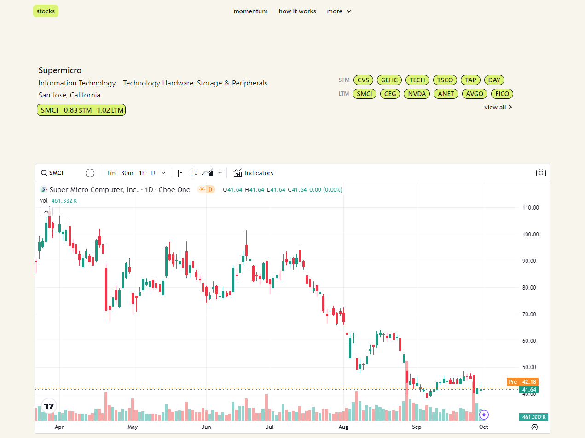
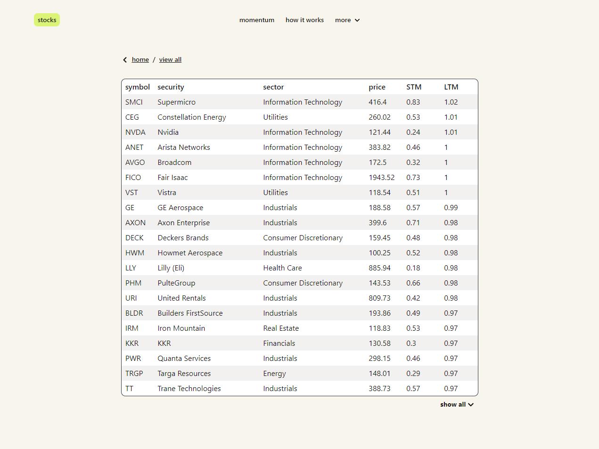

### stock momentum ranking
Project built to gather and combine data from multiple APIs to calculate stock price momentums.  
  
The short-term momentum (STM) and long-term momentum (LTM) are calculated based on price change history over a set period of time:  
STM `1 day` `5 days` `1 month` and LTM `1 year` `3 years` `5 years`.  

Price change data has weights added to adjust the impact of each of the durations, for example in short-term momentum calculations the 5 day price change value has a weight of 1.5 applied. The final values are normalised rankings ranging from 0 to 1, where 1 indicates that this stock has the best momentum score compared to the others.  
  
This project currently only supports S&P500 stocks and is still a work in progress.

